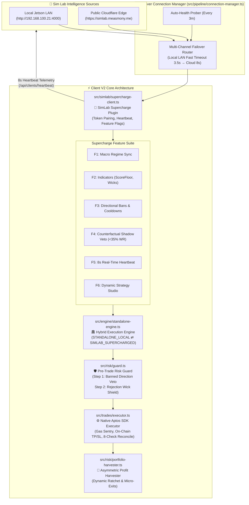

# Deep-Dive Report: Alpha Bundle Architecture & Utilization in Client V2

> **Document Version:** 1.0.0  
> **Target System:** `alpha-autonomouse-client_v2` (Next-Gen Dual-Mode Execution Desk)  
> **Source Engine:** Port 4000 Autonomous AI Simulation Lab (Claude Sonnet & Gemini 2.5 Flash / Cloud https://simlab.measmony.me)  
> **Audit Date:** September 2026  
> **Focus:** Full comparison with Client V1, granular module inspection, new capabilities, and remaining enhancement avenues.

---

## 1. Executive Architecture: Client V1 vs Client V2

Client V2 redesigns how the Alpha Bundle is consumed, transitioning from an *advisory polling loop* into a **pluggable, dual-mode supercharged plugin** with zero-downtime standalone failover.



---

## 2. Client V1 vs Client V2: Architectural Comparison Matrix

| Feature Dimension | Client V1 (`alpha-autonomouse-client_v1`) | Client V2 (`alpha-autonomouse-client_v2`) |
| :--- | :--- | :--- |
| **Connection Topology** | Single static URL (`SIM_PIPELINE_URL`, default `http://192.168.100.21:4000`). | **Multi-Channel Auto-Failover**: Toggles between Local LAN (`192.168.100.21:4000`) and Cloud (`simlab.measmony.me`) with a 3-minute background auto-probe. |
| **Authentication & Pairing** | Bearer API Key header (`CLIENT_API_KEY`). | **Base64url Token Decoding**: Automatically parses `simlab_live_...` containing `keyId`, `secret`, and `serverUrl`. Handshakes via `/api/clients/pair-by-token`. |
| **Operating State Machine** | Advisory overlay; falls back to local config on failure. | **Formal Dual-Mode State Machine**: Explicitly transitions between `STANDALONE_LOCAL` and `SIMLAB_SUPERCHARGED`. Zero downtime if Sim Lab disconnects. |
| **Feature Flag Granularity** | Global all-or-nothing sync. | **6 Independent Feature Toggles**: `syncMacroRegime`, `syncIndicators`, `syncDirectionalBans`, `syncCounterfactual`, `syncTelemetry`, `syncStrategyStudio`. |
| **Counterfactual Shadow Veto** | Post-trade attribution only (audits closed trades). | **Pre-Trade Gatekeeper (Feature 4)**: Queries Sim Lab parallel paper models in real time before entry; **vetoes candidate signals if paper WR <35%**. |
| **Directional Banning Enforcement** | Checked downstream in Layer 4 trap validator. | **Enforced at Step 1 of `RiskGuard`**: Rejects banned direction instantly before balance queries or position sizing. |
| **Rejection Wick Trap Shield** | Evaluated via external market indicators. | **Synced dynamically from Sim Lab**: `bullTrapUpperWickPct` injected directly into Step 2 of `RiskGuard`. |
| **Telemetry & Reporting** | Pushed only on trade close event. | **Continuous 8-Second Heartbeat**: Pushes subaccount address, equity, open positions, win rate, and PnL continuously to Fleet Command. |
| **On-Chain Execution Engine** | External MCP tool calls (`placeMarketOrder`, `setTpSl`). | **Native Aptos TypeScript SDK**: Builds and signs raw Move transactions directly; includes gas sentry (`aptBalance < 0.002 APT`). |
| **On-Chain Reconciliation** | Direct snapshot overwrite; defaults missing TP/SL to 0. | **Strike Counter (8 checks / 45s continuous)**: Prevents false closes caused by transient Aptos indexer hiccups. |

---

## 3. Granular Inspection of Client V2 Modules

### 3.1 `src/simlab/supercharge-client.ts` (The Core Plugin)
The central nervous system for Alpha Bundle consumption in Client V2.

#### A. Token Pairing & Handshake
- Decodes tokens formatted as `simlab_live_<base64url>`.
- Injects `X-SimLab-Client-Auth` (HMAC secret) and `x-api-key`.
- Transmits local machine metadata (delegate address, subaccount, budget, network) to register the node in the Sim Lab Fleet.

#### B. The 6 Supercharge Feature Flags
1. **`syncMacroRegime` (L559-568):**
   - Ingests `bundle.macro.regime` or `bundle.macroIntelligence.decouplingRegime`.
   - Injects world state narrative into `standaloneEngine.directives.notes`.
2. **`syncIndicators` (L570-580):**
   - Dynamically overrides `scoreFloor` (e.g. from 75% up to 82% during choppy conditions).
   - Injects `bullTrapUpperWickPct` (tolerance for upper/lower candle rejection wicks).
3. **`syncDirectionalBans` (L582-600):**
   - Ingests `macroIntelligence.bannedSide` or maps `marketBias === 'BEARISH' -> bannedSides: ['LONG']`.
   - Populates `directives.bannedSides` array in-memory.
4. **`syncCounterfactual` (L508-553 — Feature 4 Advisory):**
   - **`checkCounterfactualAdvisory(symbol, action)`:**
     - Inspects `bundle.learning.assetAdjustments[symbol]`. If the paper simulation models show `<35% win rate` across $\ge 3$ trades or status is `COOLDOWN_ADVISED`, the live trade is **vetoed immediately**.
     - Checks `bundle.learning.actionRecommendations` for asset-specific toxicity warnings.
     - When vetoed, automatically creates a local **Shadow Trade** (`SIM_COUNTERFACTUAL_VETO`) to benchmark saved capital.
5. **`syncTelemetry` (L602-690):**
   - Runs an 8-second interval dispatching live client health, balance, and open position state to `/api/clients/heartbeat`.
6. **`syncStrategyStudio` (L700-750):**
   - Allows remote dynamic switching of the active strategy profile (e.g. `MOMENTUM_BREAKOUT` vs `MEAN_REVERSION_CHOP`).

---

### 3.2 `src/pipeline/connection-manager.ts` (Multi-Channel Failover Router)
Provides connection resilience for edge clients (such as Jetson Orin Nano or Mac Studio):
- **Telemetry State & Pipeline State:** Tracks primary vs fallback URLs independently.
- **Failover Logic:**
  - Fast timeout on Local LAN (`3500ms`) to avoid blocking execution.
  - If LAN is unreachable, switches instantly to Public Cloudflare (`timeout: 8000ms`).
- **Auto-Recovery:** Probes primary LAN every 3 minutes (`PROBE_INTERVAL_MS = 180_000`). If local Port 4000 recovers, switches back from Cloudflare automatically.

---

### 3.3 `src/engine/standalone-engine.ts` (Execution Orchestrator)
Orchestrates signal generation and technical indicator math:
- Computes EMA9, EMA21, EMA50, EMA200, RSI14, ATR14, ADX14, StochRSI, and **1h Macro Trend (EMA25/50)**.
- Maintains the active `StrategyDirectives`:
  ```typescript
  export interface StrategyDirectives {
    source: 'STANDALONE_LOCAL' | 'SIMLAB_SUPERCHARGED';
    activeStrategy: string;
    scoreFloor: number;
    bullTrapUpperWickPct: number;
    bannedSides: ('LONG' | 'SHORT')[];
    regime: string;
    notes: string;
    lastUpdated: number;
  }
  ```
- **Failsafe Invariant:** If Sim Lab heartbeat fails or disconnects, calls `resetToStandaloneDirectives()`, immediately dropping back to local defaults (`scoreFloor: 75`, `bannedSides: []`, `regime: RANGING_CHOP`) without interrupting open positions or throwing unhandled errors.

---

### 3.4 `src/risk/guard.ts` (Pre-Trade Validation Desk)
Client V2's `RiskGuard` directly utilizes Alpha Bundle directives at the earliest possible stage:
- **Step 1 — Directional Ban (L49-54):**
  ```typescript
  if (directives.bannedSides && directives.bannedSides.includes(action)) {
    return this.reject(`🛑 Direction ${action} is strictly BANNED by active directives...`);
  }
  ```
- **Step 2 — Rejection Wick Shield (L56-68):**
  - Compares the candidate candle's upper/lower wick percentage against `directives.bullTrapUpperWickPct` (streamed from Sim Lab). If market makers are leaving long upper wicks (absorption trap), the trade is blocked.
- **Step 3 — Score Floor & AI Confirmation (L70-82):**
  - Requires `aiEval.confidenceScore >= directives.scoreFloor`.
- **Step 4 — Budget Cap & Sizing (L84-118):**
  - Enforces `config.BUDGET_USD` and `MAX_ALLOC_PCT` hard ceilings.

---

### 3.5 `src/trades/executor.ts` (Trade Execution & On-Chain Sentry)
- **Native Move Calls:** Directly interfaces with Decibel DEX entry contracts via Aptos SDK rather than relying solely on MCP daemon processes.
- **Gas Reserve Sentry (L546-553):** Validates that the delegate wallet has $\ge 0.002$ APT before attempting transactions, preventing failed on-chain executions and wasted nonce sequences.
- **On-Chain TP/SL Trigger Placement (L560-572):** Attaches exchange-side conditional orders immediately following market execution.
- **Reconciliation Strike Guard (L393-424):** Ingests live on-chain positions from Aptos. If a position temporarily vanishes from an indexer query, it requires **8 consecutive failed checks AND $\ge 45$ seconds** of continuous absence before assuming the position was closed on-chain.

---

### 3.6 `src/risk/portfolio-harvester.ts` (Profit Harvester Hub)
- **Sync Mode Support:**
  - `SIM_LAB_SYNC`: Accepts external dynamic calibrations from Port 4000.
  - `LOCAL_ONLY`: Uses local defaults.
  - `MANUAL_LOCK`: Operator pins parameters via Dashboard; rejects external overrides.
- **Execution Style:**
  - `FULL_CLOSE_ONLY`: Closes entire position upon harvest score trigger.
  - `PARTIAL_FIRST`: Injects dynamic trailing stops locking 80% of peak unrealized gains (`lockedProfitFloor`) while letting the runner ride.

---

## 4. Key Improvements Client V2 Brings to the Alpha Bundle

1. **Active Pre-Trade Counterfactual Veto (Feature 4):**
   - In Client V1, counterfactual simulation data was primarily studied post-trade in the learning engine.
   - In Client V2, if Sim Lab paper models show that a token is generating negative EV in the current regime, Client V2 **kills the trade before a single dollar of real capital is committed**.
2. **Instant Step-1 Risk Rejection:**
   - In Client V1, banned sides were caught late in the pipeline inside `trap-validator.ts`.
   - In Client V2, `directives.bannedSides` is checked at line 50 of `RiskGuard`, saving CPU cycles and network latency.
3. **Multi-Channel Fallover (LAN + Cloud):**
   - Eliminates single-point-of-failure risks. If the local Jetson goes down or the Docker port changes, Client V2 fails over to the Cloudflare-routed Sim Lab endpoint automatically.
4. **Resilient On-Chain Reconciliation:**
   - Client V1 could prematurely assume a trade was closed if an indexer poll returned empty. Client V2's 8-check / 45s strike counter eliminates false exit triggers.

---

## 5. Potential Gaps & Opportunities in Client V2

While Client V2 is more modular and resilient than Client V1, the audit identified three specific areas where it can be further enhanced:

| Area | Current Client V2 Behavior | Recommended Enhancement (Ported from V1 Upgrades) |
| :--- | :--- | :--- |
| **Harvester Scoring Formula** | Uses standard 6-factor score (drawdown, breakeven, $R$-multiple, min ROI, SL distance). | **Port the V1 Harvester Upgrades**: Add `simLabBannedSidePenalty` (+35 pts), CryptoQuant whale netflow absorption (+20 pts), 1h Trend Shield (+25/-15 pts), and Defensive Bleed Cutting. |
| **Dynamic `riskMultiplier`** | `RiskGuard` sizes trades with static budget percentages (`MAX_ALLOC_PCT`). | Ingest `bundle.macro.riskMultiplier` into `RiskGuard` to scale `targetAllocUsd` by 0.5x–1.2x. |
| **Stagnation Time-Stop Exit** | Does not enforce maximum bar duration on stale trades. | Ingest `strategy.stagnationTimeStopBars` to auto-harvest trades that flatline near breakeven for > $N$ bars. |

---

## 6. Summary Conclusion

Client V2 transforms the Alpha Bundle from a *loose advisory stream* into a **tightly coupled, fail-safe trading supercharger**. 

With its **6 independent feature toggles**, **pre-trade counterfactual paper model vetoes**, **multi-channel LAN/Cloud failover**, and **native Aptos SDK execution with gas sentries**, Client V2 provides an enterprise-grade execution platform that maximally protects real capital on Aptos mainnet while dynamically synchronizing with AI intelligence from Port 4000.
