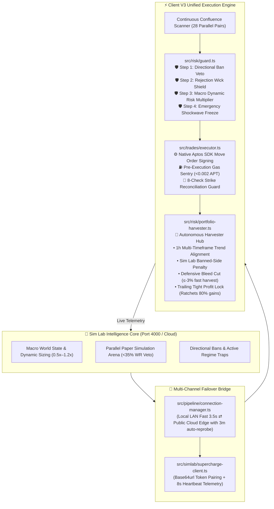

# Alpha Autonomous Client V3 (Decibel DEX • Aptos Mainnet)

[](https://aptoslabs.com)
[](https://decibel.exchange)
[](https://nodejs.org)
[](https://www.docker.com/)
[](LICENSE)

> **Next-generation autonomous perpetual futures trading client for Decibel DEX on Aptos.**  
> Features real-time on-chain Move order execution, multi-model AI decision confluence, macro volatility risk gates, autonomous profit harvesting, and a non-custodial 1-minute browser onboarding wizard.

---

## ⚡ Architecture Overview



---

## 🚀 Key Feature Highlights

### 1. 🔑 Non-Custodial Browser Onboarding Wizard
- **Zero Manual Configuration Required**: Clone, launch, and open the web dashboard at `http://localhost:5050`.
- **Pre-Onboard Menu Lockdown**: Navigation and trading docks remain protected behind a lock shield (`🔒`) until credentials are configured.
- **Gas Signer Confusion Guard**: Prevents accidentally setting your Gas Signer key address as your Trading Subaccount.
- **Real-Time On-Chain Verification**: Probes Decibel smart contracts on Aptos mainnet to verify primary ownership, delegate permissions, and available USDC collateral before activation.

### 2. 🧠 Multi-Model AI Confluence
- **Flexible Intelligence Backends**:
  - **Google Gemini**: Gemini 2.5 Flash / Flash Lite for ultra-fast, low-cost quantitative reasoning.
  - **Anthropic Claude**: Claude 3.5 Sonnet for deep market context evaluation.
  - **Local Hardware LLM**: Ollama / Qwen2.5 / DeepSeek for 100% offline, zero-data-leakage VPS & Mac execution.
  - **Pure Algorithmic Math Rules**: Zero-dependency quantitative technical confluence models requiring no API keys.
- **Dual-Model Failover**: Hot-swaps from Primary AI to Secondary AI automatically upon rate limits or latency spikes.

### 3. 🛡️ 4-Stage Pre-Trade Risk Sentinel
- **Gate 1 — Directional Ban Filter**: Immediately rejects candidate setups opposing macro regime trends.
- **Gate 2 — Rejection Wick Trap Shield**: Detects distribution wicks and absorptions to prevent buying tops or selling bottoms.
- **Gate 3 — Counterfactual Paper Veto**: Rejects trades if the live shadow simulation model on the asset exhibits $<35\%$ win rate.
- **Gate 4 — Dynamic Sizing & Shockwave Freeze**: Dynamically scales position sizing from `0.5x` in chop to `1.2x` in high-conviction trends, freezing entries during macro news shocks.

### 4. 🌾 Autonomous Profit Harvester Master
- **1-Hour Trend Alignment**: EMA25/50 higher-timeframe confluence shield (+25 pts / -15 pts).
- **Defensive Bleed Cutting**: Automatically closes bleeding positions ($\le -3.0\%$ without a breakeven stop) before margin erosion.
- **Trailing Tight Profit Lock**: Dynamically ratchets stop orders to lock in $\ge 80\%$ of peak gains.

---

## 💻 Quick Start & Setup

### Method A: Docker Deployment (Recommended)

```bash
# 1. Clone the repository
git clone https://github.com/Measmonysuon/alpha_autonomouse_v3.git
cd alpha_autonomouse_v3

# 2. Build and launch the container
docker compose up -d --build

# 3. Access your dashboard
open http://localhost:5050
```

---

### Method B: Standalone 1-Click Launchers

#### 🍎 macOS
1. Download `alpha-client-v3-macos.zip` from the [Latest Release](https://github.com/Measmonysuon/alpha_autonomouse_v3/releases).
2. Unzip and double-click `start-macos.command`.
3. The launcher will verify dependencies and launch the browser at `http://localhost:5050`.

#### 🪟 Windows
1. Download `alpha-client-v3-windows.zip` from the [Latest Release](https://github.com/Measmonysuon/alpha_autonomouse_v3/releases).
2. Unzip and double-click `start-windows.bat`.
3. The dashboard will automatically launch at `http://localhost:5050`.

---

### Method C: Node.js / NPM

```bash
# 1. Install dependencies
npm install

# 2. Build TypeScript production bundle
npm run build

# 3. Start the client
npm start

# Or run in development mode with hot-reload:
npm run dev
```

---

## 🧙‍♂️ Initial Onboarding Walkthrough

1. Navigate to **`http://localhost:5050`** in your browser.
2. The **Autonomous Agent Initial Setup Card** will be presented:
   - **Decibel Subaccount Address**: Your primary wallet or Decibel subaccount holding USDC collateral (e.g. `0x...`).
   - **Delegate Signing Private Key**: Authorized delegate signing key for order execution (`ed25519-priv-0x...`).
   - **Gas Signer Address Preview**: The card automatically derives your Aptos gas fee wallet. Send **0.05 – 0.1 APT** to this address on Aptos mainnet to cover transaction fees.
   - **AI Provider**: Select Gemini, Claude, Ollama, or built-in quantitative math rules.
   - **Admin Password**: (Optional) Protects dashboard controls if deployed on a public VPS.
3. Click **⚡ ACTIVATE AUTONOMOUS AGENT**.
4. The dashboard will verify credentials on-chain, dismiss the setup card, unlock all menus, and begin autonomous market monitoring!

---

## ⚙️ Environment Variables Reference

A pre-configured template is available at [`.env.example`](file:///.env.example). Copy to `.env` if configuring headless:

```bash
cp .env.example .env
```

| Variable | Description | Default |
| :--- | :--- | :--- |
| `DECIBEL_NETWORK` | Aptos target network (`mainnet` or `testnet`) | `mainnet` |
| `DECIBEL_DELEGATE_KEY` | Ed25519 private key used to sign trade transactions | *(Configured via Wizard)* |
| `DECIBEL_SUBACCOUNT_ADDRESS`| Aptos address holding USDC collateral on Decibel DEX | *(Configured via Wizard)* |
| `DECIBEL_NODE_API_KEY` | Dedicated Decibel Gateway Node API key | *(Dynamic Failover)* |
| `GEMINI_API_KEY` | Google Gemini API key for quantitative decision brain | *(Optional)* |
| `ANTHROPIC_API_KEY` | Anthropic Claude API key | *(Optional)* |
| `OLLAMA_BASE_URL` | Local or remote Ollama URL | `http://localhost:11434` |
| `SIMLAB_KEY` | Pairing token (`simlab_live_...`) for Sim Lab Cloud macro | *(Optional)* |
| `BUDGET_USD` | Total capital ceiling allocated for trading ($ USD) | `30.00` |
| `MAX_LEVERAGE` | Maximum allowed perpetual leverage | `5` |
| `PAPER_TRADING` | Safe simulation mode without risking real capital | `false` |
| `HEALTH_PORT` | Port for web dashboard and API server | `5050` |

---

## 🧪 Verification & Testing

Client V3 includes end-to-end automated testing suites:

```bash
# Verify Onboarding Wizard (on-chain resolution, guards, activation lifecycle)
npm run test:onboard

# Check environment, network connectivity, and kline feeds
npm run setup

# Test Telegram notification dispatch
npm run test:telegram
```

---

## 🔒 Security & Non-Custodial Architecture

- **Keys Never Leave Your Machine**: All transaction payloads are constructed and signed locally via `@aptos-labs/ts-sdk`. Private keys are never transmitted to external telemetry servers.
- **Isolated Signer / Gas Key**: Client V3 uses delegate signing keys with order-placement permissions only. Withdrawals require your primary cold wallet.
- **Zero Hardcoded Secrets**: All configuration templates and release scripts enforce clean environment variable resolution.

---

## 📜 License

Distributed under the MIT License. See [LICENSE](LICENSE) for more information.
